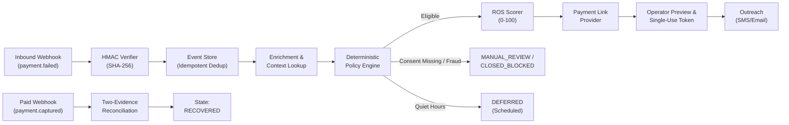

# ReTryPay — AI Revenue Recovery Engine for Razorpay

[](https://www.python.org/)
[](https://fastapi.tiangolo.com/)
[](https://reactjs.org/)
[](tests/)
[](web/)
[](https://razorpay.com)

> **ReTryPay** is an enterprise-grade, checkout-dropoff recovery system designed for the Razorpay payment ecosystem. It automatically detects failed payments from cryptographically signed webhooks, evaluates deterministic privacy and fraud guardrails, scores recovery opportunity (ROS 0–100), generates attributable Test Mode payment links, and reconciles money recovered using a strict **two-evidence protocol**.

---

## ⚡ Key Capabilities

- **Real-Time Webhook Ingestion**: Validates raw-body `X-Razorpay-Signature` HMAC-SHA256 signatures with constant-time comparison and unique `provider_event_id` replay protection.
- **Deterministic Policy Safety Engine**: Hard-coded, zero-hallucination compliance rules (`recovery-v1.3`) enforcing DPDP consent, quiet hours (`22:00`–`08:00`), per-order / 30-day contact caps, and single-action GMV limits (₹10,000 max).
- **Explainable Recovery Opportunity Scoring (ROS)**: Deterministic 0–100 scoring prioritizing transient bank failures and high-intent buyers over hard declines or fraud.
- **Two-Evidence Attribution Protocol**: Cases are marked `RECOVERED` only when both signals correlate within a 30-minute reconciliation window:
  1. `payment.captured` webhook from Razorpay
  2. Provider Payment Link status transitions to `paid` matching reference ID
- **Measured Batch Recovery Analytics**: Live database aggregation computing verified money recovered, recovery conversion rates, policy block rates, and mean time to recover.
- **Offline Counterfactual Evaluation**: 3-arm synthetic simulation (`NO_ACTION`, `GENERIC_REMINDER`, `RETRYPAY_POLICY`) calculating causal conversion lift, incremental GMV, and contact efficiency.
- **Operator Console**: Clean, dark/light financial-operations dashboard built with React and Vite.

---

## 🏗️ System Architecture & Workflow



---

## 🚀 Quick Start

### 1. Prerequisites
- **Python**: 3.11+ (Python 3.14 supported)
- **Node.js**: 18+ and `npm`

### 2. Backend Setup
```powershell
# 1. Create and activate virtual environment
python -m venv .venv
.venv\Scripts\Activate.ps1

# 2. Install dependencies
pip install -e ".[dev]"

# 3. Configure environment
Copy-Item .env.example .env

# 4. Start local backend server (Test Environment)
$env:RETRYPAY_ENV = "test"
$env:DATABASE_URL = "sqlite+aiosqlite:///./retrypay_test.db"
$env:RETRYPAY_EXPECTED_DATABASE_TARGET = "retrypay_test.db"
python -m uvicorn retrypay.api.app:app --host 127.0.0.1 --port 8000
```

### 3. Frontend Dashboard Setup
```powershell
# 1. Navigate to frontend directory
cd web

# 2. Install dependencies and start Vite dev server
npm install
npm run dev
# Dashboard opens at http://localhost:5173
```

---

## 🧪 Comprehensive Verification Suite

ReTryPay includes a multi-layer verification suite (294 backend tests, 16 frontend tests):

```powershell
# Run Full Backend Unit & Integration Tests (294 passed)
python -m pytest

# Run Python Type Checking (132 source files)
python -m mypy retrypay tests scripts

# Run Python Code Quality & Format Checks
python -m ruff check .
python -m ruff format --check .

# Run Frontend Linter & Tests (16 passed)
npm --prefix web run lint
npm --prefix web run test -- --run

# Build Frontend Production Bundle
npm --prefix web run build
```

---

## 📚 Documentation Map

Detailed technical documentation is organized in [`docs/`](docs/):

| Document | Purpose |
| :--- | :--- |
| **[`docs/ARCHITECTURE.md`](docs/ARCHITECTURE.md)** | Complete system architecture, state machine, authority hierarchy, and life of a failed payment |
| **[`docs/SETUP.md`](docs/SETUP.md)** | End-to-end setup guide, environment configuration, database routing, and CLI scripts |
| **[`docs/SAFETY.md`](docs/SAFETY.md)** | Non-negotiable safety rules, DPDP consent gating, secret handling, and test-mode isolation |
| **[`docs/DOMAIN_CONTRACTS.md`](docs/DOMAIN_CONTRACTS.md)** | Data models, DTO schemas, entity lifecycle states, and API contracts |
| **[`docs/EVALUATION.md`](docs/EVALUATION.md)** | Counterfactual 3-arm simulation protocol and causal statistical estimation rules |

---

## 🔒 Security & Privacy Notice

- **Test Mode Only**: ReTryPay is strictly locked to Razorpay Test Mode (`rzp_test_`). Live mode keys are rejected on startup.
- **Zero Sensitive Data Storage**: PAN, CVV, OTP, UPI PIN, webhook secrets, and private API keys are never persisted, logged, or serialized into UI audit trails.
- **Local Isolation**: All local simulation scenarios use self-signed HMAC fixtures with 0 external network dependencies.
