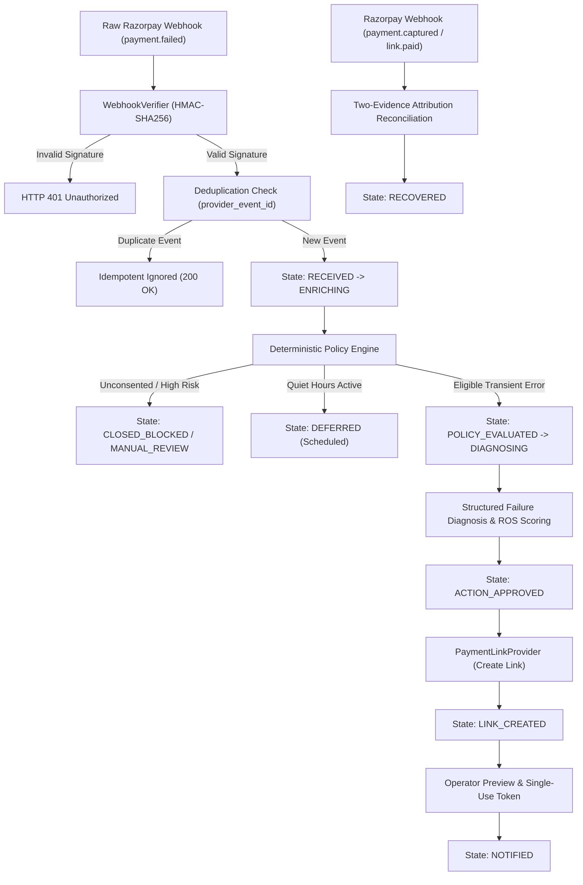

# ReTryPay — System Architecture & Workflow Guide

## 1. System Architecture & Components

ReTryPay is structured into modular layers strictly decoupled by domain boundaries:

- **Webhook API (`retrypay.api.routes.webhooks`)**:
  - Ingests raw HTTP requests from Razorpay.
  - Verifies cryptographic signature (`X-Razorpay-Signature`) against the raw request body.
  - Validates `provider_event_id` uniqueness to prevent duplicate executions and replay attacks.
- **Event Store & State Machine (`retrypay.storage`, `retrypay.domain`)**:
  - Durable, idempotent storage tracking case lifecycle states.
  - State machine: `RECEIVED → ENRICHING → POLICY_EVALUATED → {CLOSED_BLOCKED | MANUAL_REVIEW | DIAGNOSED → ACTION_APPROVED → LINK_CREATED → NOTIFIED → {RECOVERED | EXPIRED | OPTED_OUT | CLOSED_UNRECOVERED}}`.
- **Deterministic Policy Engine (`retrypay.policy`)**:
  - Versioned (`recovery-v1.3`), hard-coded rules evaluated without side-effects.
  - Evaluates consent, frequency caps, quiet hours, and amount thresholds.
- **Recovery Opportunity Score (ROS) Service (`retrypay.scoring`)**:
  - Explainable 0–100 score prioritizing recoverable failures.
- **Provider Adapters (`retrypay.adapters.razorpay`)**:
  - Encapsulates Razorpay Test Mode Payment Link API interactions.
  - Supports `FakePaymentLinkProvider` for offline test execution.
- **Two-Evidence Reconciliation Engine (`retrypay.attribution`)**:
  - Matches `payment.captured` webhooks with `paid` Payment Links within a 30-minute window.
- **Operator Console (`web/`)**:
  - React + Vite dashboard for real-time monitoring and controlled manual review.

---

## 2. Authority Hierarchy

To guarantee deterministic financial safety, ReTryPay enforces a strict hierarchy:

$$\text{Verified Webhook \& Reconciled Provider State} > \text{Database State} > \text{Policy Engine} > \text{ROS Service} > \text{Diagnosis Adapter} > \text{Estimator} > \text{UI/Dashboard}$$

1. **Webhooks Are King**: Only cryptographically verified webhooks and provider reconciliations represent payment truth.
2. **Policy is Authoritative**: AI models, LLMs, ROS scores, utility rankings, budgets, and operators cannot override a policy `BLOCK`.
3. **`NO_ACTION` Baseline**: `NO_ACTION` is always an allowable, safe candidate action.
4. **Zero Sensitive Data Leakage**: ReTryPay never logs, stores, or transmits PAN, CVV, OTP, UPI PIN, webhook secrets, or API private keys.

---

## 3. Life of a Failed Payment (End-to-End Flow)

### Sequence of Operations:
1. **Webhook Ingestion**: Razorpay dispatches `payment.failed` event. `WebhookVerifier` validates the raw request body with constant-time HMAC-SHA256 comparison. Unique database constraint on `provider_event_id` prevents replay attacks.
2. **Enrichment & Context Lookup**: Retrieves customer purchase history, masked identifiers (`+91******1234`), and explicit DPDP consent status.
3. **Deterministic Policy Evaluation**: Evaluates hard rules (`recovery-v1.3`): DPDP consent, 30-day/per-order contact caps, single-action GMV limit (₹10,000 max), and merchant quiet hours.
4. **Diagnostic Classification & ROS Scoring**: Categorizes failure reason (e.g. `PAYMENT_TIMED_OUT`, `NETWORK_FAILURE`) and computes composite 0–100 ROS score.
5. **Attributable Payment Link Creation**: Generates a test Payment Link with a deterministic reference ID linking it directly to `order_id` and `case_id`.
6. **Controlled Outreach Dispatch**: Requires single-use preview token verification before dispatching recovery reminder.
7. **Two-Evidence Attribution Reconciliation**: Marks case `RECOVERED` when both webhook signals correlate within the 30-minute window.

---

## 4. Reliability Invariants
- **Single Active Case**: Exactly one active recovery case per merchant order.
- **Idempotency**: One action execution per `(case_id, action_type, policy_version)` idempotency key.
- **Auto-Closure on Payment**: A captured or paid order automatically closes any pending recovery outreach.
- **Safe Replays**: Duplicate and out-of-order webhook events never trigger duplicate links or notifications.
