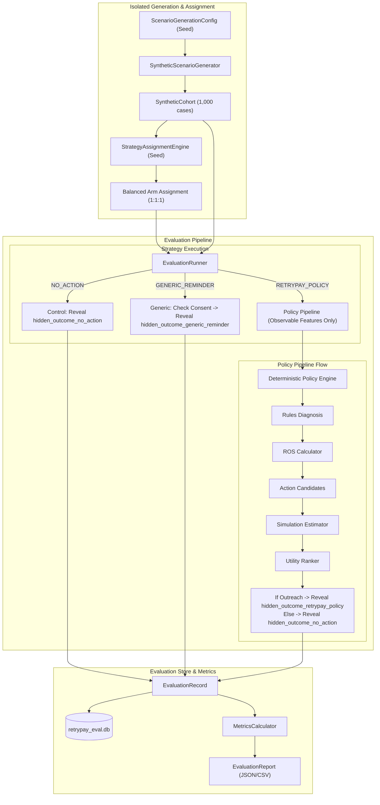

# Milestone 5: Synthetic Counterfactual Evaluation, Reproducible Strategy Assignment, and Offline Metrics

## 1. Executive Summary & Principles
Milestone 5 implements an isolated, offline counterfactual evaluation harness to estimate the incremental causal recovery impact of ReTryPay policies without touching production systems, executing live payments, or sending customer communications.

### Core Non-Negotiable Invariants
1. **Separation of Observed vs. Incremental**:
   - **Observed recovery**: Payment captured following an outreach action.
   - **Incremental recovery**: Difference in recovery outcome between ReTryPay policy and the `NO_ACTION` natural recovery baseline.
2. **Strict Data Boundary**:
   - Operational decisioning (`retrypay/policy/`, `retrypay/decision/`, `retrypay/api/`, `retrypay/execution/`, `retrypay/budget/`, `retrypay/storage/`) cannot access or import `HiddenPotentialOutcomes` or evaluation storage.
   - Hidden potential outcomes exist across all three treatment arms (`NO_ACTION`, `GENERIC_REMINDER`, `RETRYPAY_POLICY`) but are stored exclusively in the isolated `retrypay_eval.db`.
3. **Reproducibility**:
   - Deterministic seeded random number generators guarantee 100% exact reproducibility of synthetic cohorts and arm assignments.
4. **Mandatory Disclaimer**:
   Every report, visualization, or export must explicitly display:
   > `simulated offline estimate; not production conversion evidence`

---

## 2. Data Flow & Architecture

---

## 3. Data-Access Boundary Matrix

| Subsystem / Module | Observable Features | Merchant Policy Config | Diagnosis & ROS | Hidden Potential Outcomes | Assigned Strategy | Realized Outcome |
| :--- | :--- | :--- | :--- | :--- | :--- | :--- |
| **Policy Engine** | Yes | Yes | No | **NO (Forbidden)** | **NO** | **NO** |
| **Diagnosis & ROS** | Yes | No | Yes | **NO (Forbidden)** | **NO** | **NO** |
| **Estimator & Ranker** | Yes | No | Yes | **NO (Forbidden)** | **NO** | **NO** |
| **Operational Webhook / API**| Yes | Yes | Yes | **NO (Forbidden)** | **NO** | Yes (Live only) |
| **Evaluation Generator** | Generates | Generates | Generates | Generates | No | No |
| **Evaluation Assignment** | Reads ID | No | No | No | Generates | No |
| **Evaluation Runner** | Reads | Reads | Reads | Reads (for revelation) | Reads | Generates |
| **Evaluation Storage** | Reads | No | No | Persists | Persists | Persists |
| **Metrics Calculator** | Reads Summary| No | Reads Metadata | Reads Realized only | Reads | Reads Realized only |

---

## 4. Strategy Definitions

1. **`NO_ACTION`**:
   - Pure control arm baseline.
   - Zero Payment Links created, zero customer notifications sent, zero contacts recorded.
   - Revealed outcome: `hidden_outcome_no_action`, GMV: `hidden_gmv_no_action_paise`.

2. **`GENERIC_REMINDER`**:
   - Untailored recovery reminder simulation.
   - Requires valid customer WhatsApp consent and absence of high risk.
   - If eligible: `contact_count = 1`, revealed outcome: `hidden_outcome_generic_reminder`.
   - If ineligible: `contact_count = 0`, revealed outcome: `hidden_outcome_no_action`.

3. **`RETRYPAY_POLICY`**:
   - Full ReTryPay deterministic decisioning based strictly on observable features.
   - If policy evaluates to `ELIGIBLE` and selected action is outreach (`SEND_RETRY_LINK`, `DELAY_AND_SEND_RETRY_LINK`, `SEND_RETRY_LINK_WITH_ALTERNATIVE_METHOD_HINT`):
     - `contact_count = 1`
     - Revealed outcome: `hidden_outcome_retrypay_policy`, GMV: `hidden_gmv_retrypay_policy_paise`
   - If policy evaluates to `BLOCK`, `MANUAL_REVIEW`, `DEFER`, or selects `NO_ACTION`:
     - `contact_count = 0`
     - Revealed outcome: `hidden_outcome_no_action`, GMV: `hidden_gmv_no_action_paise`

---

## 5. Metric Definitions & Formulas

| Metric Name | Formula / Definition | Report Label |
| :--- | :--- | :--- |
| **Observed Recovery GMV** | $\sum \text{recovered\_gmv}_{\text{strategy}}$ | `synthetic offline observed outcome; not production evidence` |
| **Natural Recovery Rate** | $\frac{N_{\text{recovered, NO\_ACTION}}}{N_{\text{NO\_ACTION}}}$ | Natural recovery rate |
| **Estimated Incremental Recovery Conversion** | $\text{Rate}_{\text{RETRYPAY\_POLICY}} - \text{Rate}_{\text{NO\_ACTION}}$ | Estimated incremental recovery conversion |
| **Estimated Incremental Recovery GMV** | $\text{GMV}_{\text{RETRYPAY\_POLICY}} - \left(\text{GMV}_{\text{NO\_ACTION}} \times \frac{N_{\text{RETRYPAY\_POLICY}}}{N_{\text{NO\_ACTION}}}\right)$ | Estimated incremental recovery GMV |
| **Contact Efficiency** | $\frac{\text{GMV}_{\text{RETRYPAY\_POLICY}}}{\text{Contacts}_{\text{RETRYPAY\_POLICY}}}$ | Contact efficiency (Paise/Contact) |
| **Incremental GMV per Contact** | $\frac{\text{Incremental GMV}_{\text{RETRYPAY\_POLICY}}}{\text{Contacts}_{\text{RETRYPAY\_POLICY}}}$ | Incremental GMV per contact |

### Statistical Uncertainty (Bootstrap 95% Confidence Intervals)
- Number of bootstrap iterations: 1,000 (seeded).
- Resamples with replacement independently from `NO_ACTION` and `RETRYPAY_POLICY` arms.
- Emits empirical 2.5th and 97.5th percentiles.
- Emits `status = "insufficient_sample"` if sample size in any arm is $< 10$.

---

## 6. Limitations & Scope Constraints
- **Synthetic Data**: All cases are generated deterministically and do not represent actual live merchant checkout transactions.
- **No Production Conversion Claims**: Offline simulation estimates are directional model benchmarks and cannot be cited as real-world revenue lift.
- **No Per-Customer Causal Attribution**: Counterfactual potential outcomes are unobservable in production; individual payment captures must never be labeled as "caused by ReTryPay".
- **Production Experimentation**: Real-world validation requires randomized holdout experimentation with verified webhooks and reconciled payment truth.
