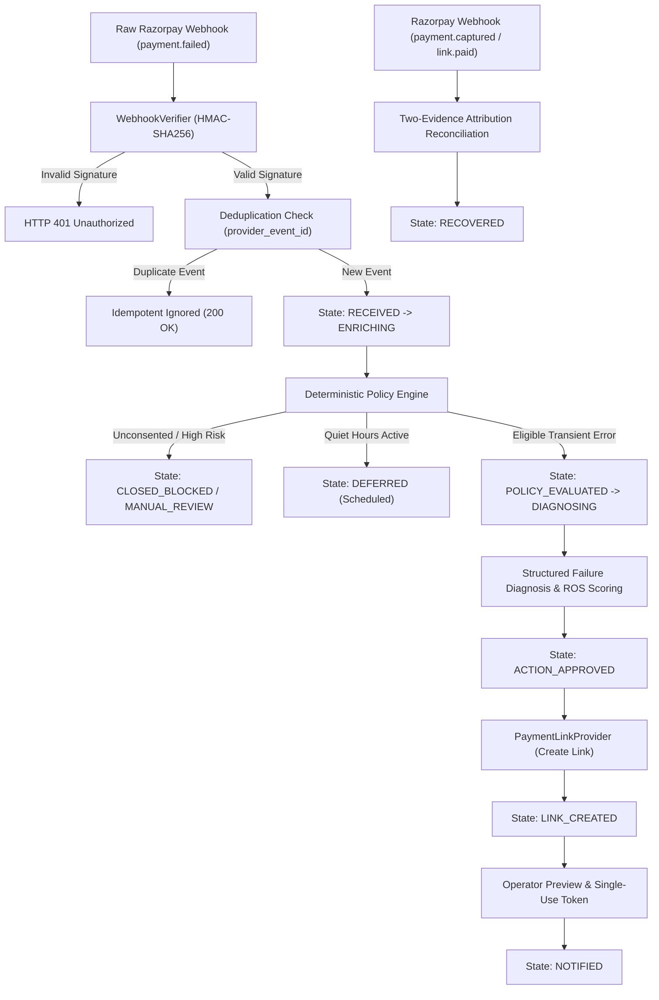

# ReTryPay — Comprehensive Project Architecture, Workflow & System Guide

---

## 1. Executive Summary & Mission

**ReTryPay** is an enterprise-grade, merchant-facing checkout recovery engine designed for payment ecosystems like Razorpay. When digital payment attempts fail due to transient PSP dropouts, bank network hiccups, or timeout errors, merchants lose revenue and customers abandon carts.

ReTryPay automates the recovery lifecycle:
1. It ingests verified webhook failure events in real time.
2. It evaluates deterministic compliance and privacy policies.
3. It assesses customer purchase history and recovery probability (ROS).
4. It safely generates attributable Test Mode Payment Links.
5. It enforces strict operator guardrails and single-use token confirmation before outreach.
6. It reconciles payment truth using a two-evidence correlation protocol.

---

## 2. Core Architectural Principles & Authority Hierarchy

### 2.1 The Non-Negotiable Authority Hierarchy
To prevent AI hallucinations, race conditions, or unauthorized payouts from impacting money movement, ReTryPay enforces a strict hierarchy of truth:

$$\text{Verified Webhook \& Reconciled Provider State} > \text{Database State} > \text{Policy Engine} > \text{ROS Service} > \text{Diagnosis Adapter} > \text{Estimator} > \text{UI/Dashboard}$$

- **Webhooks Are King**: Only cryptographically verified webhooks (`X-Razorpay-Signature` HMAC-SHA256) and provider reconciliations represent payment truth. Browser redirects and client callbacks are never trusted alone.
- **Policy is Authoritative**: AI models, LLMs, ROS scores, utility rankings, budgets, and operators **cannot** override a policy `BLOCK`.
- **`NO_ACTION` Baseline**: `NO_ACTION` is always an allowable, safe candidate action.
- **Zero Sensitive Data Leakage**: ReTryPay never logs, stores, or transmits PAN, CVV, OTP, UPI PIN, webhook secrets, or API private keys.

---

## 3. End-to-End Workflow: Life of a Failed Payment



### Step-by-Step Breakdown:
1. **Webhook Ingestion**:
   - Razorpay dispatches `payment.failed` to `/api/v1/webhooks/razorpay`.
   - `WebhookVerifier` validates the raw request body against `RAZORPAY_WEBHOOK_SECRET` using constant-time HMAC comparison.
   - Unique database constraint on `provider_event_id` prevents replay attacks and duplicate mutations.

2. **Enrichment & Privacy Gate**:
   - Case enters `RECEIVED` and immediately transitions to `ENRICHING`.
   - Customer profile is retrieved: masked identifiers (`+91******1234`), successful purchase history count, and explicit channel consent (`OPTED_IN` / `OPTED_OUT`).
   - Time is evaluated against merchant quiet hours (`22:00` to `08:00` in `Asia/Kolkata`).

3. **Deterministic Policy Evaluation**:
   - Evaluated against hard rules (`recovery-v1.3`):
     - **Consent Check**: Has customer opted in for communication?
     - **Contact Caps**: Has customer exceeded max 30-day contacts (`RETRYPAY_MAX_MSGS_PER_CUSTOMER_30D = 3`) or max order contacts (`RETRYPAY_MAX_MSGS_PER_ORDER = 2`)?
     - **Error Code Gating**: Is the failure transient (e.g. `BAD_REQUEST_PAYMENT_TIMED_OUT`) or a hard decline/fraud risk (`CARD_DECLINED_BY_BANK`, `SUSPECTED_FRAUD`)?
   - **Outcomes**: `ELIGIBLE`, `BLOCK`, `MANUAL_REVIEW`, or `DEFER`.

4. **Diagnostic Classification & ROS Prioritization**:
   - **Diagnosis**: Categorizes error reason into structured categories (`PAYMENT_TIMED_OUT`, `AUTHENTICATION_INCOMPLETE`, `NETWORK_FAILURE`).
   - **Recovery Opportunity Score (ROS)**: Deterministic 0–100 integer score combining base recoverability, customer purchase history, payment method, and recency.

5. **Payment Link Generation**:
   - An attributable Test Mode payment link is created with a deterministic `reference_id` linking it to `order_id` and `case_id`.
   - In Demo/Live Test Mode, calls Razorpay Test Mode API (`https://api.razorpay.com/v1/payment_links`).
   - In Test/CI Mode, handled offline by `FakePaymentLinkProvider`.

6. **Outreach & Operator Control**:
   - Generates a cryptographically signed, single-use preview token before dispatch.
   - Operator reviews the sanitized preview and confirms dispatch via SMS/WhatsApp or Email.

7. **Two-Evidence Attribution & Closure**:
   - When the customer pays, ReTryPay requires **two distinct evidences** to mark the case `RECOVERED`:
     1. Webhook `payment.captured` on original or child payment attempt.
     2. Provider payment link status transition to `paid` matching the reference ID within the reconciliation window (30 minutes).

---

## 4. Detailed Breakdown of Dashboard Sections

The dashboard provides a real-time command center for payment operations and policy governance.

```
┌────────────────────────────────────────────────────────────────────────┐
│  ReTryPay Operator Console                                              │
├───────────────┬────────────────────────────────────────────────────────┤
│ Navigation    │ Main Content Workspace                                 │
│               │                                                        │
│ • Overview    │ 1. Overview: Real-time operational telemetry & metrics │
│ • Cases       │ 2. Recovery Cases: Interactive case control plane      │
│ • Evaluation  │ 3. Causal Evaluation: 3-Arm synthetic counterfactual   │
│ • Simulator   │ 4. Webhook Simulator: Local test fixture dispatcher    │
│ • Policy      │ 5. Policy & Guardrails: Read-only safety snapshot      │
└───────────────┴────────────────────────────────────────────────────────┘
```

---

### Section 1: Overview (`/`) — Merchant Recovery Telemetry

**Purpose**: High-level operational pulse of payment failures, recovery pipeline throughput, and audit event stream.

- **KPI Metric Cards**:
  - **Failed Events Ingested**: Total number of HMAC-verified failure webhooks processed.
  - **Active Cases**: Cases currently progressing through the recovery pipeline.
  - **Verified Recoveries**: Recovered cases verified via the two-evidence protocol.
  - **Policy Block Rate**: Percentage of failures blocked by deterministic safety gates.
  - **Manual Review Rate**: Percentage of edge cases flagged for human review.
  - **Simulated Notifications**: Total outreach dispatches logged.
- **Pipeline State Breakdown**: Real-time counter of cases in every state (`RECEIVED`, `ENRICHING`, `POLICY_EVALUATED`, `LINK_CREATED`, `NOTIFIED`, `RECOVERED`, `CLOSED_BLOCKED`).
- **Recent Recovery Cases**: Live list of the latest cases with direct links to deep inspection.
- **Sanitized Audit Event Timeline**: Append-only log of system mutations, displaying timestamp, event type (`CASE_CREATED`, `STATE_TRANSITION`, `POLICY_EVALUATED`), and actor (`SYSTEM` / `OPERATOR`).

---

### Section 2: Recovery Cases (`/cases`) — Control Plane & Investigation Workspace

**Purpose**: Case management table and detailed forensic workspace for individual recovery cases.

#### Case List:
- **Search & Filters**: Search by Case ID or Order ID; filter by Source (`Razorpay Test Mode`, `Local Simulation`), State, Policy Decision, and ROS Band (`HIGH >65`, `MEDIUM 35-65`, `LOW <35`).
- **Data Table**: Scannable row items showing masked customer info, order amounts in ₹ INR, policy decision chips, and payment link status.

#### Case Detail Workspace (`/cases/:caseId`):
- **Hero Summary**: Large Case ID, source badge, state chip, order ID, and formatted order amount.
- **3-Column Context Grid**:
  - **Customer Context**: Masked phone (`+91******1234`), masked email, prior purchase count, and WhatsApp/SMS consent status (`OPTED_IN` / `OPTED_OUT`).
  - **Failed Attempt Context**: Provider payment ID, payment method (`UPI`, `Card`, `Netbanking`), error code, reason, and error description.
  - **Decision Telemetry**: Policy gate outcome, composite ROS score (0–100), diagnosis category, candidate action, and delivery mode.
- **Outreach & Reminder Controls**:
  - **Eligible Cases**: Unlocks the **"Send reminder"** button. Clicking opens a modal, fetches a single-use token preview, and dispatches via approved channels.
  - **`MANUAL_REVIEW` / Blocked Cases**: Button is strictly disabled with an intentional policy banner displaying the exact blocking reasons:
    `CONTACT_CONSENT_MISSING` • `INSUFFICIENT_CONTEXT` • `PAYMENT_LINK_NOT_CREATED`
- **Tabbed Forensic Workspace**:
  1. `Chronological Timeline`: Step-by-step state progress with timestamped logs.
  2. `Policy Gating`: Hard policy rules evaluated, triggered reason codes, and policy version.
  3. `ROS & Diagnosis`: Detailed breakdown of ROS feature contributions (e.g. base +60, history +12) and simulated candidate action rankings.
  4. `Payment Link & Messaging`: Attributable payment link metadata (Provider Link ID, reference ID, expiration date) and dispatched notification logs.
  5. `Sanitized audit event timeline`: Full audit trail of state changes and sanitized metadata.

---

### Section 3: Causal Evaluation (`/evaluation`) — Synthetic Counterfactual Simulation

**Purpose**: Offline statistical evaluation benchmarking ReTryPay's policy against natural recovery and generic reminders using synthetic potential outcomes.

> **Mandatory Evaluation Disclaimer**: `simulated offline estimate; not production conversion evidence`.

- **3-Strategy Treatment Arm Comparison**:
  1. **`NO_ACTION` (Control Baseline)**: Natural customer recovery rate without any merchant intervention.
  2. **`GENERIC_REMINDER`**: Standard outreach sent to all customers regardless of consent or error type.
  3. **`RETRYPAY_POLICY`**: ReTryPay's intelligent, consent-gated, ROS-prioritized recovery engine.
- **Causal Lift & Efficiency Metrics**:
  - **Estimated Incremental Recovery Conversion**: Causal lift over control ($\Delta = P(\text{Recovery} \mid \text{Policy}) - P(\text{Recovery} \mid \text{No Action})$) with a 95% Confidence Interval. Displays `Inconclusive in this synthetic run` if the interval crosses zero.
  - **Estimated Incremental Recovery GMV**: Additional gross merchandise value generated above natural recovery.
  - **Contact Efficiency**: Gross recovered GMV generated per outreach message (`₹ per synthetic contact`).
  - **Incremental GMV per Synthetic Contact**: Net incremental revenue per contact sent.
- **Policy Safety & Compliance Telemetry**: Unsafe action rate (strictly 0.0%), policy block rate, manual review rate, and quiet-hours deferral rate.

---

### Section 4: Webhook Simulator (`/simulator`) — Local Test Fixture Dispatcher

**Purpose**: Local testing tool to dispatch signed test webhooks and verify state machine transitions without external network calls or Razorpay dashboard access.

- **Guardrail**: Strictly enabled only when `RETRYPAY_ENV=test`. In `demo` mode, returns `HTTP 403 Forbidden` with a safety notice directing operators to use Razorpay Test Mode webhooks.
- **Scenario Selector**: Includes scenarios across categories:
  - *Policy Gating*: Missing Consent Block, Quiet Hours Deferral, Rate Limit Suppression.
  - *End-to-End Flow*: Eligible Recovery Outreach Flow (UPI timeout -> link creation -> simulated notification).
  - *Risk & Fraud*: High-Risk / Hard-Decline Manual Review (`SUSPECTED_FRAUD`).
  - *Reconciliation*: Out-of-Order Webhook, Late Failure on Paid Order, Replay Attack.
- **Execution Inspector**: Displays expected state, dispatches locally signed HMAC payload, shows HTTP step codes, and provides a direct shortcut link to the newly created case.

---

### Section 5: Policy & Operational Guardrails (`/settings`) — Governance Snapshot

**Purpose**: Read-only configuration snapshot showing active merchant thresholds, caps, and algorithm versions.

- **Recovery Policy Configuration**:
  - `Environment`: `TEST` or `DEMO`
  - `Policy Version`: `recovery-v1.3`
  - `Attribution Reconciliation Window`: `30 Minutes`
  - `Quiet Hours`: `22:00 - 08:00 (Asia/Kolkata)`
- **Operational Guardrails & Caps**:
  - `Single Action GMV Limit`: Max ₹10,000 per auto-recovery.
  - `Daily Merchant GMV Cap`: Daily recovery limit across all orders.
  - `Daily Action & Contact Caps`: Rate limits preventing customer message fatigue.
  - `Max Manual Review Queue Depth`: Guardrail preventing review queue backlog overflow.
- **Scoring & Engine Versions**:
  - `Razorpay Error Mapper`: Error translation rules version.
  - `ROS Model`: `ros-v1.0`
  - `Simulation Estimator`: `sim-estimator-v1`
- **LLM Advisory Configuration**:
  - Provider status (`Gemini` / `Rules Default`), model name (`gemini-3.7-flash`).
  - Strict advisory notice: *LLM output is restricted to diagnosis classification & explanation only. AI cannot authorize an action or override deterministic policy.*

---

## 5. Real-Time vs. Offline Simulation Matrix

| Component / Section | Mode | Data Source | Real External Calls? |
| :--- | :--- | :--- | :--- |
| **Webhook Ingestion** | **Real-Time** | Inbound Razorpay Webhooks (via Tunnel/Server) | Real HMAC verification |
| **State Machine & Storage** | **Real-Time** | Async SQLite Database | Real async database transactions |
| **Policy Engine** | **Real-Time** | Real-time case evaluation | Deterministic rules engine |
| **Payment Link Creation (Demo)** | **Real-Time** | Razorpay Test Mode API (`/v1/payment_links`) | Real Razorpay Test Mode API |
| **Payment Link Creation (Test)** | **Offline** | `FakePaymentLinkProvider` | 0 network calls (Deterministic fakes) |
| **Operator Reminder Dispatch** | **Real-Time** | Dashboard operator console | Verified single-use token flow |
| **Overview & Case Tracking** | **Real-Time** | Live database state | Live API querying |
| **Causal Evaluation** | **Offline / Simulation** | Synthetic cohort generator & hidden outcomes | Evaluated against offline synthetic potential outcomes |
| **Webhook Simulator** | **Local Simulation** | Local fixture payloads | Self-signed HMAC-SHA256 fixtures |

---

## 6. Safety Rules & Compliance Invariants

1. **Never Execute Live Payments**: ReTryPay is strictly locked to Test Mode (`rzp_test_`). Any key beginning with `rzp_live_` raises an immediate startup exception.
2. **Never Message Real Customers**: Reminder sending in demo/test modes uses simulated dispatch or test phone/email fixtures.
3. **Never Store Secrets in Code or Logs**: Secrets are loaded via environment variables and never exposed in sanitized audit logs or UI API responses.
4. **Authoritative Idempotency**: All provider events are indexed and verified. Replays return `{"status": "ignored"}` and cause zero secondary mutations.
5. **No Synthetic Claims on Real Data**: Real cases are labeled as observed payments; synthetic potential outcomes are strictly restricted to the Evaluation module.

---

## 7. Quick Reference: Useful Commands

```powershell
# Run Full Backend Unit & Integration Test Suite
python -m pytest

# Run Python Typechecks & Linters
python -m mypy retrypay tests scripts
python -m ruff check .

# Run Frontend Verification Suite
npm --prefix web run lint
npm --prefix web run test -- --run
npm --prefix web run build

# Start Local Dev Servers
# Backend API (PowerShell):
$env:RETRYPAY_ENV = "test"
$env:DATABASE_URL = "sqlite+aiosqlite:///./retrypay_test.db"
$env:RETRYPAY_EXPECTED_DATABASE_TARGET = "retrypay_test.db"
python -m uvicorn retrypay.api.app:app --host 127.0.0.1 --port 8000

# Frontend Dashboard:
npm --prefix web run dev
```
